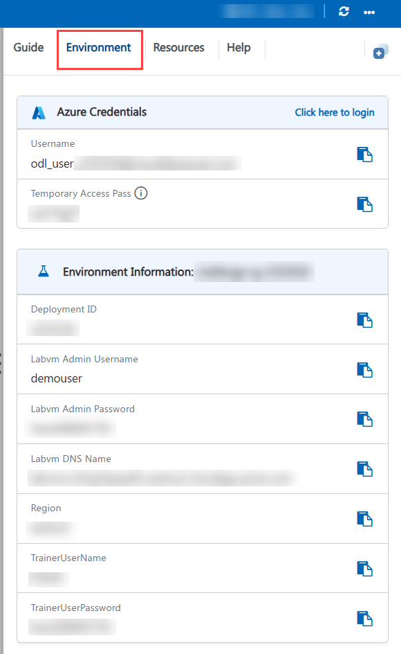
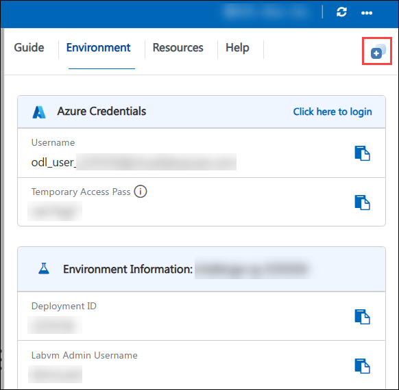
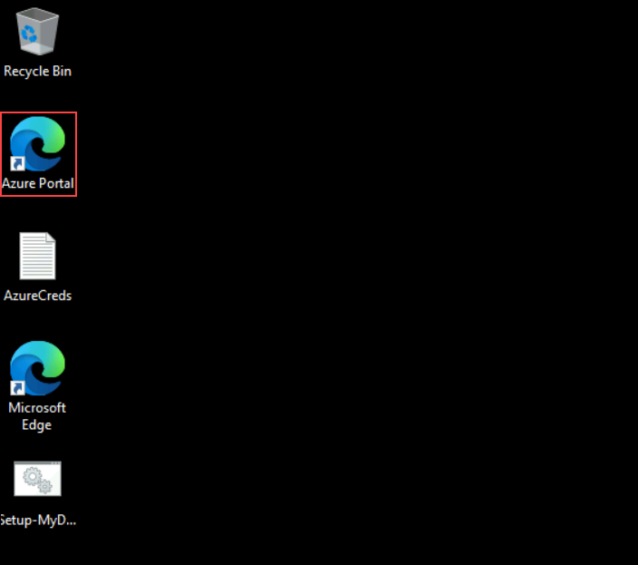

## Getting Started with Challenge

We've prepared a seamless environment for you to explore and learn. Let's begin by making the most of this experience.

### Accessing Your Challenge Environment

Once you're ready to dive in, your virtual machine and challenge guide will be right at your fingertips within your web browser.


### Exploring Your Challenge Resources

To get a better understanding of your challenge resources and credentials, navigate to the Environment tab.



### Utilizing the Split Window Feature

For convenience, you can open the challenge guide in a separate window by selecting the Split Window button from the Top right corner.



### Managing Your Virtual Machine

Feel free to start, stop, or restart your virtual machine as needed from the Resources tab. Your experience is in your hands!


> **Note:** If the VM is not in use, please **deallocate** it to avoid unnecessary resource consumption.

## Let's Get Started with Microsoft Azure

1. In the JumpVM, click on **Azure Portal** browser shortcut which is created on the desktop.

   

1. On the **Sign into Microsoft** tab, you will see the login screen. Enter the provided email or username and click **Next** to proceed.

   - Email/Username: <inject key="AzureAdUserEmail"></inject>

     

1. Now, enter the following Temporary Access Pass and click on **Sign in**.

   - Temporary Access Pass: <inject key="AzureAdUserPassword"></inject>

     

1. If you see the pop-up **Stay Signed in?**, click No.

   

---

## Download the Opportunity Dataset

A dataset of 20 closed-lost opportunity records has been prepared for this lab. You will upload this file to Azure Blob Storage in Challenge 1 - download it now so it is ready.

1. Download the dataset file:

   ```
   https://raw.githubusercontent.com/CloudLabsAI-Azure/Lost-Opportunity-Recovery-Challenge/main/data/opportunities.csv
   ```

   Save the file to your Desktop or Downloads folder. This CSV contains 20 lost deals across five loss-reason categories (Pricing, Competitor, Product Fit, Long Approval Cycle, Delayed Response) and is the data source you will index in Challenge 1.

---

## Verify Access to Required Services

Confirm you can access all services that will be used during the challenge before you begin:

1. Open a new browser tab and navigate to Microsoft Copilot Studio:

   ```
   https://copilotstudio.microsoft.com
   ```

   Sign in with the provided credentials and confirm access is granted.

1. Open another browser tab and navigate to Power Automate:

   ```
   https://make.powerautomate.com
   ```

   Sign in and confirm that access to Premium connectors and the Dynamics 365 connector is available under your license.

1. Navigate to Microsoft AI Foundry:

   ```
   https://ai.azure.com
   ```

   Sign in and confirm the pre-provisioned Foundry project is visible, or confirm you have permission to create a new project.

   > **Note:** If any service access is unavailable, navigate to the Environment tab in your challenge portal to retrieve alternate credentials or contact CloudLabs support.

---

Now, click on **Next** from the lower right corner to move on to the challenge.

## Happy Hacking!!
